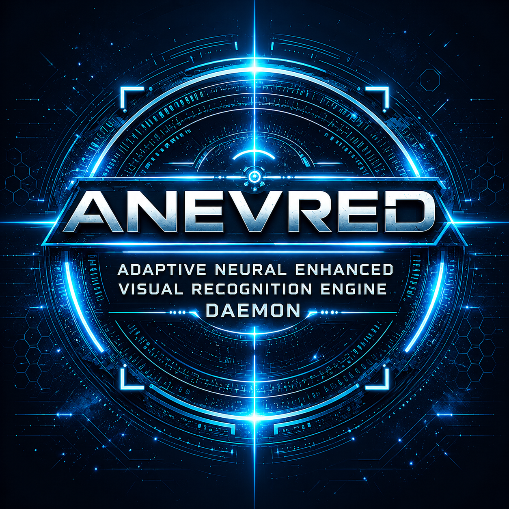

<p align="center">
  
</p>

# ANEVRED

**Adaptive Neural Enhanced Visual Recognition Engine Daemon**

ANEVRED is a Windows gaming companion for Star Citizen and other demanding PC games. It combines system monitoring, safe optimization helpers, protected-process handling, Star Citizen tools, adaptive UI dimming, and an experimental live OCR translation overlay.

<p align="center">
  <a href="https://buymeacoffee.com/anevred"></a>
  <a href="https://paypal.me/Anevred"></a>
</p>

## Why ANEVRED exists

ANEVRED started as a personal tool to avoid unnecessary alt-tabbing during gameplay. It has grown into a local-first gaming assistant focused on readability, accessibility, performance awareness, and quality-of-life improvements.

## Highlights

- Live OCR screen translation overlay
- Layout-aware translated text rendering
- Chrome Translator API integration when available
- Adaptive UI dimming / night vision support for bright scenes
- Real-time CPU, RAM, GPU, VRAM, frametime, pagefile, and process monitoring
- Safe optimization actions for RAM, CPU load, VRAM pressure, and background tasks
- Protected process list for system, launcher, anti-cheat, and user-selected processes
- Star Citizen hub with session state, log support, profile awareness, and hotkeys
- Local learning history for recommendation tuning
- Dark and light themes with responsive dashboard panels
- Multi-language UI support
- Tray integration and startup-friendly window handling

## Live translation overlay

ANEVRED can capture a selected screen region, run OCR locally through Windows OCR, and translate detected text with Chrome's Translator API when supported by the installed Chrome build.

The overlay is designed for complex game UIs: it tries to preserve paragraphs, screen positions, and readability instead of dumping translated text into one large block.

## UI dimming / night vision

The UI dimming overlay helps reduce extreme brightness and color washout in visually intense scenes while keeping HUD elements readable. It can be toggled by hotkey and tuned from the settings page.

## Safety model

ANEVRED uses conservative local actions:

- Protected processes are not terminated or modified
- Anti-cheat and system processes are excluded from unsafe actions
- Recommendations can be ignored
- Local learning can be disabled
- Privacy mode keeps learned data on the local machine

## Build

Requirements:

- Windows
- .NET 10 SDK with Windows desktop support

Build:

```powershell
dotnet build ANEVRED.csproj -c Release
```

If the normal `obj` folder is locked on your machine, use custom build folders:

```powershell
New-Item -ItemType Directory -Force -Path buildtmp, buildobj-local, buildbin-local | Out-Null
$env:TEMP=(Resolve-Path buildtmp).Path
$env:TMP=$env:TEMP
dotnet build ANEVRED.csproj -c Release -p:BaseIntermediateOutputPath=buildobj-local\ -p:BaseOutputPath=buildbin-local\
```

## Support

If ANEVRED helps you enjoy your gaming sessions, support helps fund new features, testing, and future releases.

- ☕ Buy Me a Coffee: https://buymeacoffee.com/anevred
- 💙 PayPal: https://paypal.me/Anevred
- 🚀 Star Citizen referral: https://www.robertsspaceindustries.com/enlist?referral=STAR-4WLN-4RNF

## Documentation

- [Product Description](docs/PRODUCT.md)
- [Feature Overview](docs/FEATURES.md)
- [Release Text](docs/RELEASE_NOTES.md)
- [Support ANEVRED](docs/SUPPORT.md)

## Status

ANEVRED is an active desktop project. Some features, especially live translation and Star Citizen-specific helpers, are experimental and depend on Windows OCR, Chrome capabilities, and the current Star Citizen UI.
