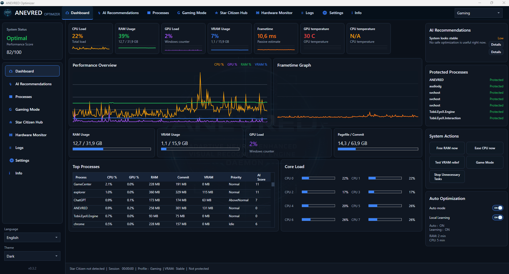
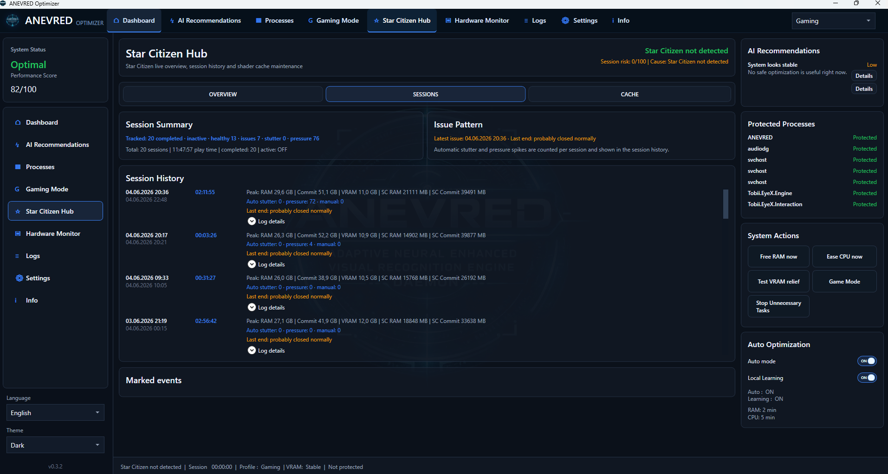
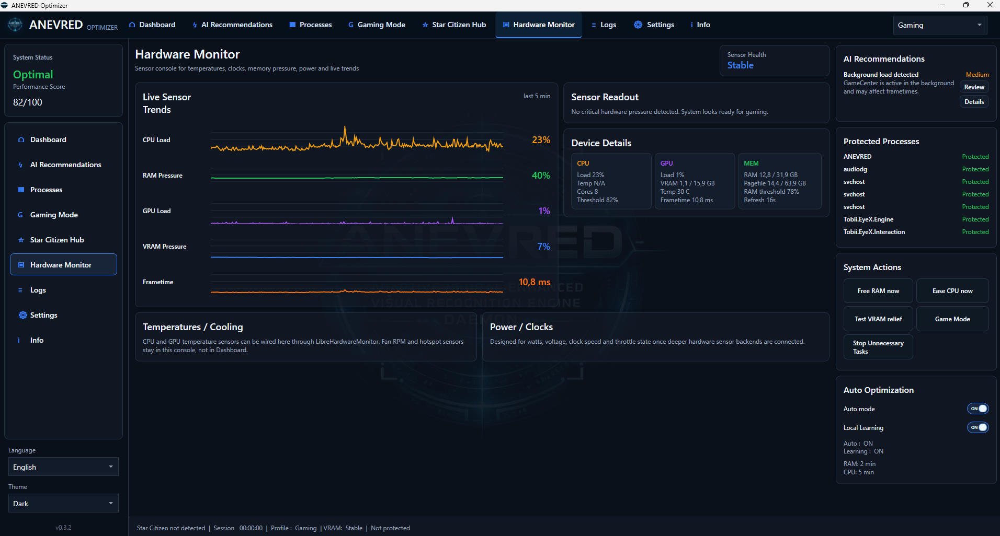
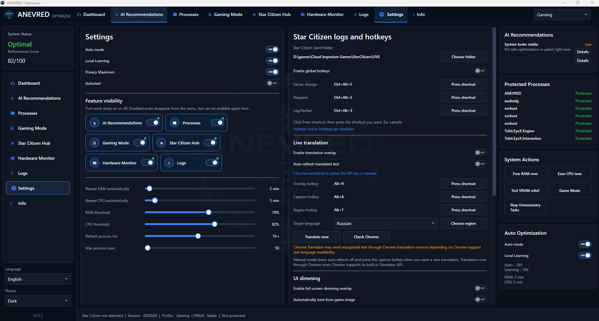

  

# ANEVRED

**Windows Gaming Optimization, Hardware Monitoring and Star Citizen Assistant**

ANEVRED is a local-first desktop application focused on performance monitoring, safe optimization, hardware visibility, Star Citizen session tracking, and visual comfort tools.

> Monitor your system, optimize background activity, track Star Citizen sessions, and improve visibility without game modifications.

## Screenshots

### Dashboard

### Star Citizen Hub

### Hardware Monitor

### Settings

## What You See In The Application

- Real-time CPU, RAM, GPU and VRAM monitoring
- AI-style recommendation engine
- Safe process protection and optimization tools
- Star Citizen session analytics and event tracking
- Hardware monitoring and sensor dashboards
- UI dimming and visual comfort tools

  
  

## Why ANEVRED Exists

I do not own a high-end system.

With a moderate CPU and 32 GB of RAM, I wanted a way to:

- monitor resource usage in real time
- detect unnecessary background activity
- free memory when needed
- reduce distractions while playing
- access useful information without alt-tabbing
- keep control over what is running on my system
- react quickly when Star Citizen starts to stutter or behave strangely

ANEVRED was built to solve those problems first. This no-overlay build keeps the focus on optimization, monitoring, control, Star Citizen session tracking, and visual comfort.

## Main Features

### System Monitoring

- CPU monitoring
- RAM and pagefile monitoring
- GPU and VRAM monitoring
- frametime estimate
- process analysis
- performance overview dashboard
- local recommendation hints

### Optimization Tools

- safe background process management
- memory cleanup tools
- CPU priority adjustment for selected background processes
- protected process lists
- automatic optimization profiles
- gaming mode presets
- restore of ANEVRED-changed process priorities on app exit

### Star Citizen Integration

- Star Citizen process awareness
- session tracking
- persistent session history
- total session time summary
- Game.log and logbackup analysis for session-end hints
- server change, respawn, lag, and stutter markers
- hotkey support for quick event logging
- security-process hints during active sessions

### UI Dimming

For bright scenes, night play, and improved visibility.

- adjustable RGB filtering
- full-screen dimming overlay
- hotkey controlled
- optional auto tuning from the current image
- overlay is removed when ANEVRED exits

## Safety Model

ANEVRED uses conservative local actions:

- no kernel drivers
- no anti-cheat bypass
- no game memory reading or editing
- no shader injection
- protected processes are not terminated or modified
- system, security, launcher, and anti-cheat processes are excluded from unsafe actions
- GPU driver, audio, and input-device helper processes are protected by default
- "Stop Unnecessary Tasks" asks for confirmation and only requests normal window close; it does not force-kill apps
- process priorities changed by ANEVRED are restored on app exit
- recommendations can be ignored
- local learning can be disabled
- privacy mode keeps learned data on the local machine
- this no-overlay build does not include screen capture, text recognition, or translation overlay components

Experimental areas are labeled in the app. VRAM relief, memory compression controls, and background app close requests should be treated as opt-in troubleshooting tools, not automatic cleanup magic.

## Build

Requirements:

- Windows
- .NET 10 SDK with Windows desktop support. .NET 10 is the intended target for this project.

## Support

If ANEVRED helps you enjoy your gaming sessions, support helps fund testing, development and future releases.

- Buy Me a Coffee: https://buymeacoffee.com/anevred
- PayPal: https://paypal.me/Anevred
- Star Citizen referral: https://www.robertsspaceindustries.com/enlist?referral=STAR-4WLN-4RNF

## Documentation

- [Product Description](docs/PRODUCT.md)
- [Feature Overview](docs/FEATURES.md)
- [Release Text](docs/RELEASE_NOTES.md)
- [Support ANEVRED](docs/SUPPORT.md)
